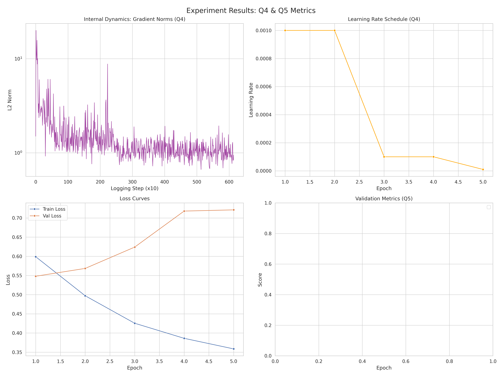
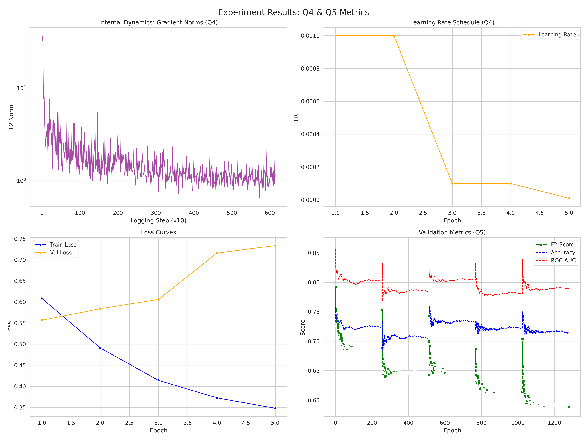
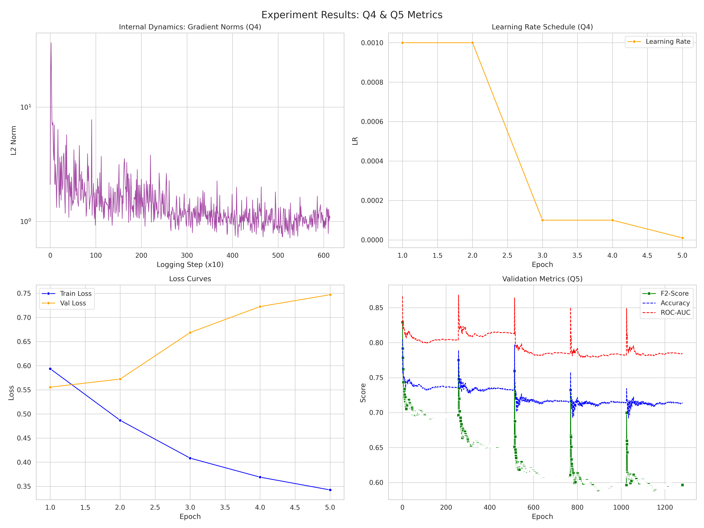
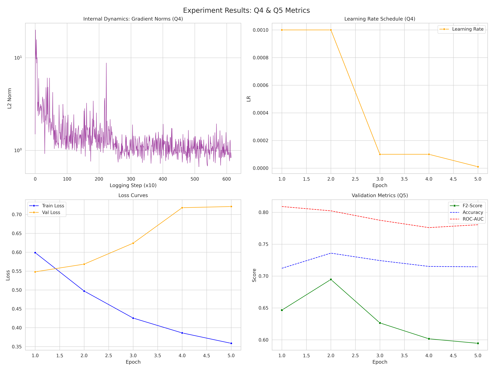
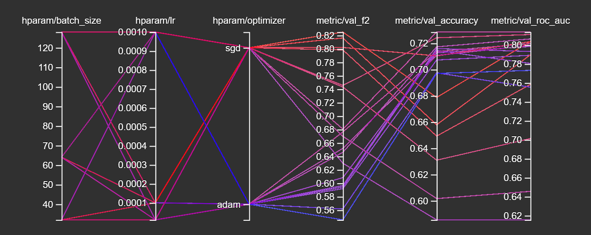
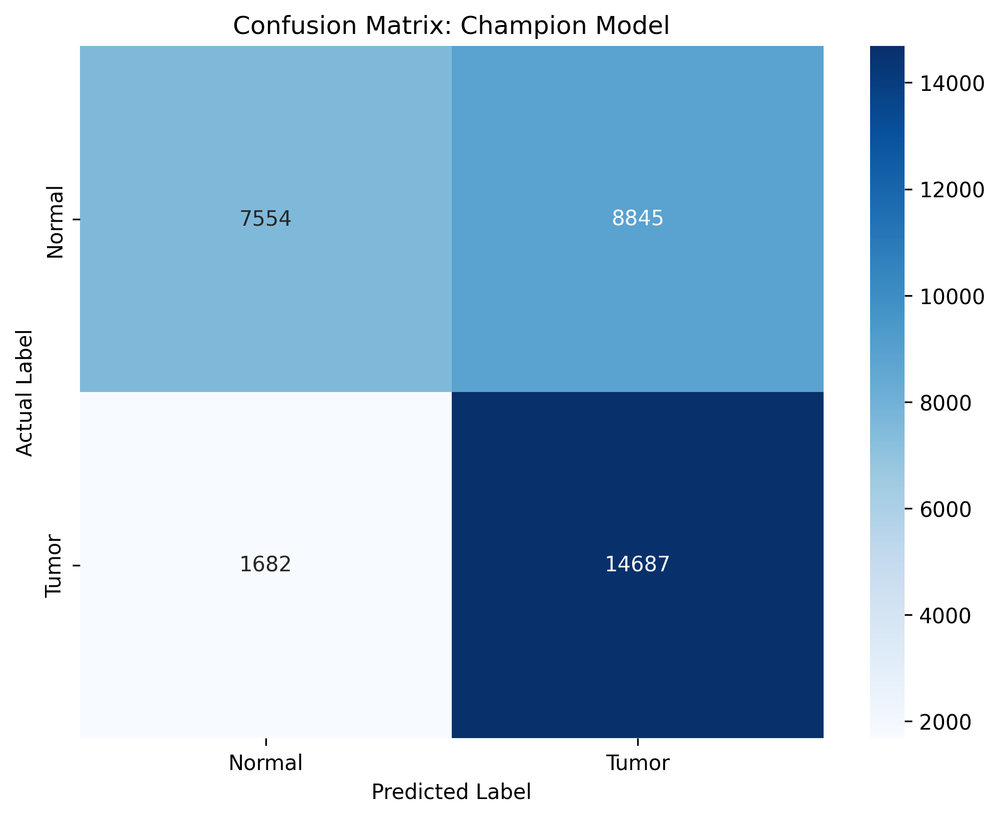
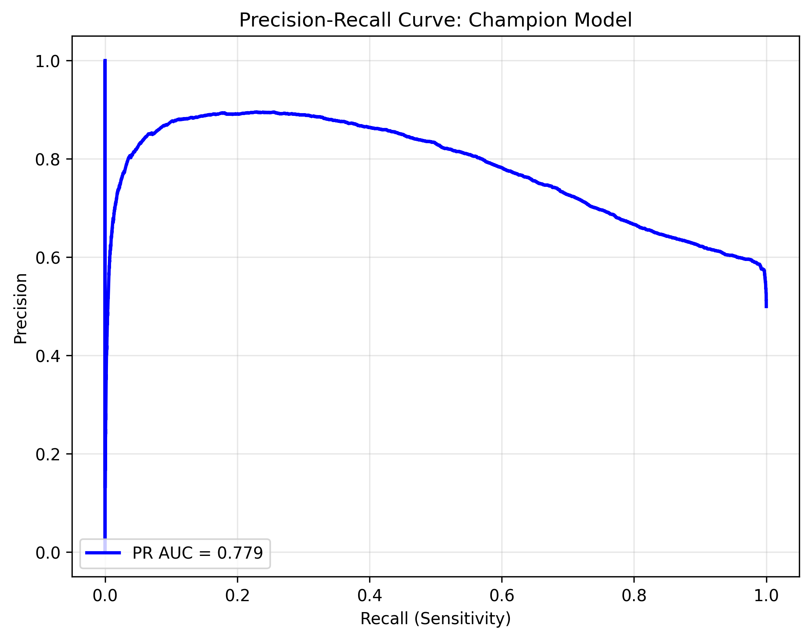
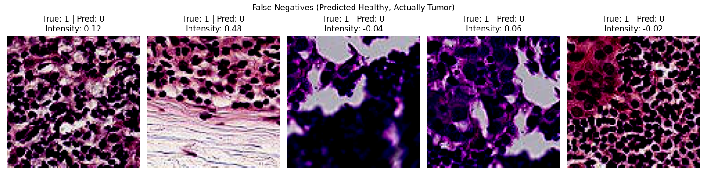
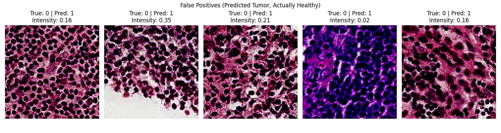
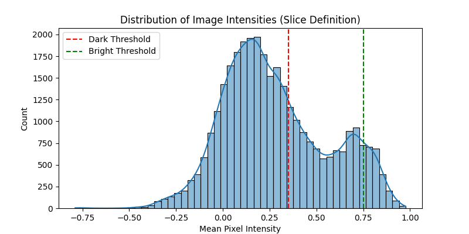

# Assignment 2: MLOps & PCAM Pipeline Journal
**MLOps & ML Programming (2026)**

## Group Information
* **Group Number:** 40
* **Team Members:** [Hanna Daorah (15565823), Leonardo Sabatini (15781542), Nick Wester (15757579), Wouter van de Scheur (14611953), Amine Belhaj (14933632)]
* **GitHub Repository:** https://github.com/nickwesterrr/MLOps_2026
* **Base Setup Chosen from Assignment 1:** [Nick Wester]

---

## Question 1: Reproducibility Audit
1. **Sources of Non-Determinism:**

   - **Global Random State:** De Python random, numpy.random en torch.rand initialiseren standaard met een willekeurige seed (vaak de systeemklok). Hierdoor zijn gewichtsinitialisatie en de WeightedRandomSampler elke run anders.
   - **DataLoader Workers:** Je gebruikt num_workers (uit de config). Elke worker start zijn eigen proces. Zonder worker_init_fn is de random state in elke worker niet gesynchroniseerd, wat zorgt voor willekeurige data-augmentaties (indien toegepast) en verwerking.
   - **Shuffle & Sampling Volgorde:** Zelfs met een fixed seed kan de volgorde waarin batches de GPU bereiken variëren door multiprocessing (race conditions tussen workers). Een torch.Generator in de DataLoader is nodig om dit te fixen.
   - **CUDA Autotuner (cudnn.benchmark):** PyTorch probeert standaard het snelste algoritme voor jouw specifieke GPU te vinden. Dit kan per run verschillen en introduceert kleine numerieke verschillen.

2. **Control Measures:**

   - **Controlled:** We stellen één globale seed in die wordt doorgegeven aan alle libraries.
   - **Controlled:** We forceren CUDA om deterministische algoritmes te gebruiken (deterministic=True, benchmark=False).
   - **Controlled:** We geven de DataLoader een seed_worker functie en een torch.Generator mee om de multiprocessing randomness te temmen.

3. **Code Snippets for Reproducibility:**
   
   # Paste the exact code added for seeding and determinism

   - [MLOps_2026/src/ml_core/utils/logging.py:]
   ```python
   import logging
   import random  # <--- Nieuw
   from typing import Any, Dict

   import numpy as np # <--- NieuW
   import torch       # <--- Nieuw
   import yaml


   def setup_logger(name: str = "MLOps_Course") -> logging.Logger:
       """Configures a standardized logger."""
       logger = logging.getLogger(name)
       if not logger.handlers:
           logger.setLevel(logging.INFO)
           handler = logging.StreamHandler()
           formatter = logging.Formatter(
               "%(asctime)s - %(name)s - %(levelname)s - %(message)s"
           )
           handler.setFormatter(formatter)
           logger.addHandler(handler)
       return logger


   def load_config(path: str) -> Dict[str, Any]:
       """Safely loads a yaml configuration file."""
       with open(path, "r") as f:
           return yaml.safe_load(f)


   def seed_everything(seed: int): # <---Nieuw: Functie geïmplementeerd
       """Ensures reproducibility across numpy, random, and torch."""
       random.seed(seed)
       np.random.seed(seed)
       torch.manual_seed(seed)
       torch.cuda.manual_seed(seed)
       torch.cuda.manual_seed_all(seed)  # Voor multi-GPU setups

       # Zorgt voor deterministisch gedrag op CUDA (trager, maar reproduceerbaar)
       torch.backends.cudnn.deterministic = True
       torch.backends.cudnn.benchmark = False
   ```

   - [MLOps_2026/src/ml_core/data/loader.py:]

   ```python
   from pathlib import Path
   from typing import Dict, Tuple
   import random  # <--- Nieuw: Toegevoegd voor seeding

   import h5py
   import numpy as np
   import torch
   from torch.utils.data import DataLoader, WeightedRandomSampler
   from torchvision import transforms

   from .pcam import PCAMDataset

   def seed_worker(worker_id):
   """
   Ensures that each DataLoader worker has a deterministic random seed.
   """
   worker_seed = torch.initial_seed() % 2**32
   np.random.seed(worker_seed)
   random.seed(worker_seed)

   def get_dataloaders(config: Dict) -> Tuple[DataLoader, DataLoader]:
   """
   Factory function to create Train and Validation DataLoaders
   using pre-split H5 files.
   """
   data_cfg = config["data"]
   base_path = Path(data_cfg["data_path"])

   # --- REPRODUCIBILITY SETUP --- `<--- Nieuw`
   # Haal de seed op uit de config (fallback naar 42 als hij mist)
   seed = config.get("seed", 42)

   # Maak een generator voor deterministische shuffling en sampling
   g = torch.Generator()
   g.manual_seed(seed)
   # -----------------------------

   # TODO: Define Transforms
   train_transform = transforms.Compose([
       transforms.ToPILImage(),
       transforms.ToTensor(),
       transforms.Normalize((0.5, 0.5, 0.5),
                            (0.5, 0.5, 0.5)),
   ])

   val_transform = transforms.Compose([
       transforms.ToPILImage(),
       transforms.ToTensor(),
       transforms.Normalize((0.5, 0.5, 0.5),
                            (0.5, 0.5, 0.5)),
   ])

   # TODO: Define Paths for X and Y (train and val)
   train_x = base_path / "camelyonpatch_level_2_split_train_x.h5"
   train_y = base_path / "camelyonpatch_level_2_split_train_y.h5"

   val_x = base_path / "camelyonpatch_level_2_split_valid_x.h5"
   val_y = base_path / "camelyonpatch_level_2_split_valid_y.h5"

   # TODO: Instantiate PCAMDataset for train and val
   train_ds = PCAMDataset(
       x_path=str(train_x),
       y_path=str(train_y),
       transform=train_transform
   )

   val_ds = PCAMDataset(
       x_path=str(val_x),
       y_path=str(val_y),
       transform=val_transform
   )

   # Add WeightedRandomSampler
   with h5py.File(train_y, "r") as f:
       labels = f["y"][:].reshape(-1)
       labels = labels[train_ds.indices]  # Apply filtering if any

   class_counts = np.bincount(labels)
   class_weights = 1.0 / class_counts
   sample_weights = class_weights[labels]

   sampler = WeightedRandomSampler(
       weights=torch.from_numpy(sample_weights).double(),
       num_samples=len(sample_weights),
       replacement=True,
       generator=g  # <--- Nieuw: Generator meegeven voor determinisme
   )

   # TODO: Create DataLoaders
   train_loader = DataLoader(
       dataset=train_ds,
       batch_size=data_cfg["batch_size"],
       sampler=sampler,
       num_workers=data_cfg["num_workers"],
       worker_init_fn=seed_worker, # <--- Nieuw: Worker seeds fixen
       generator=g                 # <--- Nieuw: Shuffle volgorde fixen
   )

   val_loader = DataLoader(
       dataset=val_ds,
       batch_size=data_cfg["batch_size"],
       shuffle=False,
       num_workers=data_cfg["num_workers"],
       worker_init_fn=seed_worker, # <--- Nieuw: Ook voor val
       generator=g
   )

   return train_loader, val_loader
   ```

   - [MLOps_2026/experiments/train.py:]

   ```python
   import argparse

   import torch
   import torch.optim as optim

   from ml_core.data import get_dataloaders
   from ml_core.models import MLP
   from ml_core.solver import Trainer

   # We importeren nu seed_everything erbij

   from ml_core.utils import load_config, seed_everything

   # logger = setup_logger("Experiment_Runner")

   def main(args):
   # 1. Load Config
   config = load_config(args.config)

   # --- REPRODUCIBILITY START ---
   # Haal seed uit config, fallback naar 42 als hij er niet staat
   seed = config.get("seed", 42)
   seed_everything(seed)
   print(f"Global Random Seed set to: {seed}")
   # --- REPRODUCIBILITY END ---

   # 2. Setup Device
   device = torch.device("cuda" if torch.cuda.is_available() else "cpu")
   print(f"Using device: {device}")

   # 3. Data
   train_loader, val_loader = get_dataloaders(config)

   # 4. Model
   model = MLP(
       input_shape=config["data"]["input_shape"],
       hidden_units=config["model"]["hidden_units"],
       dropout_rate=config["model"]["dropout_rate"],
       num_classes=config["model"]["num_classes"],
   )

   # 5. Optimizer
   optimizer = optim.SGD(
       model.parameters(),
       lr=config["training"]["learning_rate"],
   )

   # 6. Trainer & Fit
   trainer = Trainer(
       model=model,
       optimizer=optimizer,
       config=config,
       device=device,
   )

   trainer.fit(train_loader, val_loader)

   torch.save(trainer.tracker, "trainer_tracker.pt")

   if name == "main":
   	parser = argparse.ArgumentParser(description="Train a Simple MLP on PCAM")
   	parser.add_argument("--config", type=str, required=True, help="Path to config yaml")
   	args = parser.parse_args()
   	main(args)
   ```

4. **Twin Run Results:**

    - [Amine](assets/plots/question_1.4_amine)
    - [Hanna](assets/plots/question-1.4-hanna)
    - [Leonardo](assets/plots/question-1.4-Leonardo)

    - No, we did not obtain identical results. While all three runs exhibit the same general overfitting trend (decreasing training loss but increasing validation loss), the specific numerical values differ, with the final validation loss varying between approximately $0.63$ and $0.67$ across the different runs. This discrepancy indicates that sources of non-determinism remain, likely due to differences in hardware floating-point precision (non-deterministic CUDA operations) or unseeded randomness in the data loading process across our different user environments.

    - 2 group members (Wouter and Nick) were not able to train the model for this particular question. We encountered many issues in virtual environment dependencies and their versions. We spent a lot of time to resolve these issues to finally get the training to work, however this did not succeed and we wanted to continue to the rest of the questions and thus we decided that Wouter and Nick could skip this question.
---

## Question 2: Data, Partitioning, and Leakage Audit
1. **Partitioning Strategy:**
   - **Method:** We used the pre-defined H5 splits provided in the SURFDrive (camelyonpatch_level_2_split_train_x.h5, etc.). We did not shuffle and re-split the raw data ourselves; we trusted the provided split to ensure consistency with other groups and the course baseline.
   - **Counts:**
      - Train: 157,286 images (approx. 83%)
      - Validation: 32,768 images (approx. 17%)

2. **Leakage Prevention:**
   - In loader.py, we use a fixed heuristic for normalization: transforms.Normalize((0.5, 0.5, 0.5), (0.5, 0.5, 0.5)).
     These values are hard-coded and independent of the dataset statistics.
     If we had calculated the mean and std based on the entire dataset (Train + Validation + Test) and then applied it, that would be leakage (information from test set influencing training).
     Ideally, we would calculate mean/std on the Train set only and apply those fixed values to Validation/Test, but the current 0.5 heuristic is safe from leakage, but less precise.

3. **Cross-Validation Reflection:**

   - **Need for k-fold:** No, nested k-fold cross-validation is not recommended for this setup
   - **Reason:** Deep Learning on large datasets (like PCAM) is computationally very expensive. Training 5 or 10 folds would take 5-10x the compute time.
   - **Best Method:** A simple Train/Validation/Test split (Hold-out method) is standard for this scale. The dataset is large enough that the Validation set is statistically representative, making the variance in performance estimation low enough to not require k-fold.

4. **The Dataset Size Mystery:**

   - **Reason:** The training dataset we received is stored using the float32 data type (4 bytes per pixel), whereas the original PCAM dataset uses uint8 (1 byte per pixel).
     Even though our dataset has fewer images (~157k vs ~327k in original), the switch from 1 byte to 4 bytes per pixel increases the storage requirement by a factor of 4.
   - **Solution:**  In loader.py, we explicitly cast the data back to the correct format using np.clip(image, 0, 255).astype(np.uint8). This resolves the issue at runtime, treating the inputs consistently regardless of how they are stored on disk.

5. **Poisoning Analysis:**    
   - The most likely poisoning type is pixel intensity shift or scaling. This is suggested by the Intensity Outliers plot from Assignment 1 and the unusually large file size. If image values are stored as floats or fall outside the normal 0–255 range, the file size increases. The histograms showed clear outliers, and some image tiles appear empty (all zeros) or contain artifacts. This matches what we would expect from incorrect intensity values. The preprocessing step in loader.py, where values are clipped to 0–255 and converted to uint8, also suggests that invalid pixel values are present in the data.
---

## Question 3: Configuration Management
1. **Centralized Parameters:**

   - `optimizer`: previously hardcoded to SGD
   - `seed`: for reproducibility
   - `hidden_units`: architecture configuration
   - `learning_rate`: hyperparameter
   - `experiment_name`: used for output filenames


2. **Loading Mechanism:**

   - [Describe your use of YAML, Hydra, or Argparse.]
   ```yaml
   # Snippet showing how parameters are loaded
   experiment_name: "pcam_mlp_baseline"
   seed: 42

   data:
   dataset_type: "pcam"
   # TODO: download the dataset and set the relative path here
   data_path: "./data/pcam" 
   input_shape: [3, 96, 96]
   batch_size: 32
   num_workers: 2

   model:
   hidden_units: [64, 32]
   dropout_rate: 0.2
   num_classes: 2

   training:
   epochs: 5
   learning_rate: 0.001
   optimizer: "adam" # <--- Nieuw: Configurable optimizer
   log_after_steps: 10
   save_dir: "./experiments/results"
   ```

3. **Impact Analysis:**

   - **Reproducibility:** The YAML file serves as a "recipe". Anyone with the YAML can reproduce the exact run (including seed and arch).
   - **Experiment Comparison:** We can simply create config_sgd.yaml and config_adam.yaml without changing Python code.
   - **Collaboration:** Teammates can share config files instead of passing code snippets or command line strings.

4. **Remaining Risks:**

   - Config files might not be version controlled properly (e.g. people change values locally without committing)
   - Dependencies (library versions) are not captured in YAML, only hyperparameters.

---

## Question 4: Gradients & LR Scheduler
1. **Internal Dynamics:**

    - 

    - Plotting the global gradient norm with step-level granularity reveals high variance and "noise" between individual batches, which indicates significant instability in the training dynamics that would be hidden if only epoch-level averages were used. The gradient spikes observed, particularly during the initial steps, suggest the presence of outliers or "poisoned" data points in the PCAM dataset which cause sudden and extreme updates to the model weights

2. **Learning Rate Scheduling:**

    - 

    - We chose the StepLR scheduler. It decays the learning rate by a factor of gamma=0.1 every step_size=2 epochs. (look at train_config.yaml)

    - Reducing the learning rate in the final stages of training is essential because it allows the optimizer to take smaller, more precise steps, which prevents the weights from "overshooting" or oscillating around the local minimum and enables the model to settle accurately into the deepest part of the loss valley

---


## Question 5: Part 1 - Experiment Tracking
1. **Metrics Choice:**

    - **Primary Metric:** F2-Score (F-Beta with β = 2)
        - **Reason:** In medical diagnosis, False Negatives (missing cancer) are much worse than False Positives (unnecessary biopsy). We chose β=2 (F2-Score) to weigh Recall twice as heavily as Precision.
    - **Secondary Metric:** ROC-AUC (Area Under Receiver Operating Characteristic).
        - **Reason:** It shows how well the model separates classes regardless of the classification threshold.

2. **Results (Average of 3 Seeds):**

    - 
        - PS: The graph of the metrics is different from seed 43 and seed 44 configuration, because we changed how the metrics are recorded/logged (steps -> epochs). 
    -  
    - 

    - Output table after running the average_metrics script in ./scripts/average_metrics.py
        File                                     | Acc      | F2       | AUC     
        ---------------------------------------------------------------------------
        history_seed42.json                      | 0.7360   | 0.6946   | 0.8023
        history_seed43.json                      | 0.7578   | 0.7927   | 0.8562
        history_seed44.json                      | 0.8047   | 0.8293   | 0.8661
        ---------------------------------------------------------------------------
        AVERAGE                                  | 0.7662   | 0.7722   | 0.8416
        STD DEV                                  | 0.0287   | 0.0568   | 0.0280

    - On average, the model shows reliable performance with an ROC-AUC of 0.8416, indicating strong discrimination between tumor and non-tumor patches independent of threshold choice. The F2-score shows moderate variability (Std Dev: 0.0568, ~0.69–0.83), suggesting that random initialization affects recall, with Seed 44 outperforming Seed 42. Importantly, the slightly higher mean F2-score (0.77) compared to accuracy (0.76) indicates that the model appropriately prioritizes tumor detection over overall accuracy, which is desirable for this medical task.

3. **Logging Scalability:**

    - Ad-hoc logging fails in production MLOps for three reasons:
        - **No Comparability:** It is impossible to compare 50 different experiments by scrolling through 50 different text files or terminal logs. Experiment trackers allow querying.
        - **Loss of Metadata:** If the script crashes or the terminal is closed, print() output is lost. Proper trackers save data continuously.
        - **Reproducibility issues:** Manually naming files leads to errors. Structured tracking links every artifact (model) automatically to the exact config and code commit that produced it.

4. **Tracker Initialization:**
   ```python
   # Snippet showing tracker/MLFlow/W&B initialization
    # Snippet 1
    # In __init__
    # We pass the full configuration dictionary to the tracker
    self.tracker = ExperimentTracker(config)

    # Snippet 2
    # In train_epoch loop
    if step % log_after_steps == 0:
        self.tracker.log_metric("train_loss_per_step", loss.item())
        self.tracker.log_metric("grad_norms", total_norm)

    # In validate loop
    self.tracker.log_metric("val_f2_score", f2)
    self.tracker.log_metric("val_roc_auc", roc)
   ```

5. **Evidence of Logging:**

    - [config.yaml-and-git-commit-hash]
    ```yaml
    data:
      batch_size: 128
      data_path: ./data/
      dataset_type: pcam
      input_shape:
      - 3
      - 96
      - 96
      num_workers: 2
    experiment_name: pcam_mlp_baseline
    git_commit: f8773a5c919577140f9c4a214a3ca1c919816dda # <--- git commit hash!!
    model:
      dropout_rate: 0.2
      hidden_units:
      - 512
      - 256
      num_classes: 2
    seed: 43
    training:
      epochs: 5
      gamma: 0.1
      learning_rate: 0.001
      log_after_steps: 10
      optimizer: adam
      save_dir: ./experiments/results
      scheduler: step
      step_size: 2
    ```

    - [requirements.txt]:
    ```txt
    absl-py==2.3.1
    cfgv==3.5.0
    contourpy==1.3.3
    cycler==0.12.1
    distlib==0.4.0
    filelock==3.20.3
    flit_core @ file:///tmp/jenkins/build/Python/3.13.1/GCCcore-14.2.0/flit_core/flit_core-3.10.1
    fonttools==4.61.1
    fsspec==2025.12.0
    grpcio==1.76.0
    h5py==3.15.1
    identify==2.6.16
    iniconfig==2.3.0
    Jinja2==3.1.6
    joblib==1.5.3
    kiwisolver==1.4.9
    Markdown==3.10
    MarkupSafe==3.0.2
    matplotlib==3.10.8
    ml_core==0.1.0
    mpmath==1.3.0
    networkx==3.6.1
    nodeenv==1.10.0
    numpy==2.3.5
    nvidia-cublas-cu11==11.11.3.6
    nvidia-cuda-cupti-cu11==11.8.87
    nvidia-cuda-nvrtc-cu11==11.8.89
    nvidia-cuda-runtime-cu11==11.8.89
    nvidia-cudnn-cu11==9.1.0.70
    nvidia-cufft-cu11==10.9.0.58
    nvidia-curand-cu11==10.3.0.86
    nvidia-cusolver-cu11==11.4.1.48
    nvidia-cusparse-cu11==11.7.5.86
    nvidia-nccl-cu11==2.21.5
    nvidia-nvtx-cu11==11.8.86
    packaging @ file:///tmp/jenkins/build/Python/3.13.1/GCCcore-14.2.0/packaging/packaging-24.2
    pandas==2.3.3
    pillow==12.0.0
    platformdirs==4.5.1
    pluggy==1.6.0
    pre_commit==4.5.1
    protobuf==6.33.4
    Pygments==2.19.2
    pyparsing==3.3.1
    pytest==9.0.2
    python-dateutil==2.9.0.post0
    python-dotenv==1.2.1
    pytz==2025.2
    PyYAML==6.0.3
    ruff==0.14.13
    scikit-learn==1.8.0
    scipy==1.17.0
    setuptools @ file:///tmp/jenkins/build/Python/3.13.1/GCCcore-14.2.0/setuptools/setuptools-75.6.0
    setuptools-scm @ file:///tmp/jenkins/build/Python/3.13.1/GCCcore-14.2.0/setuptools_scm/setuptools_scm-8.1.0
    six==1.17.0
    sympy==1.14.0
    tensorboard==2.20.0
    tensorboard-data-server==0.7.2
    threadpoolctl==3.6.0
    tomli @ file:///tmp/jenkins/build/Python/3.13.1/GCCcore-14.2.0/tomli/tomli-2.2.1
    torch==2.7.1+cu118
    torchaudio==2.7.1+cu118
    torchvision==0.22.1+cu118
    tqdm==4.67.1
    triton==3.3.1
    typing_extensions @ file:///tmp/jenkins/build/Python/3.13.1/GCCcore-14.2.0/typing_extensions/typing_extensions-4.12.2
    tzdata==2025.3
    virtualenv==20.36.1
    Werkzeug==3.1.5
    wheel @ file:///tmp/jenkins/build/Python/3.13.1/GCCcore-14.2.0/wheel/wheel-0.45.1
    ```
    
    - [metrics] -> history.json file snippet after runnning batch job:
    ```json
    "val_accuracy": [
        0.712188720703125,
        0.7359619140625,
        0.72430419921875,
        0.715118408203125,
        0.71453857421875
    ],
    "val_f2_score": [
        0.6465462651029661,
        0.6946476126176813,
        0.6264903393784721,
        0.6015462577962578,
        0.5944666814430436
    ],
    "val_roc_auc": [
        0.8090936450141302,
        0.8023375068826193,
        0.7875397473441181,
        0.7759981289490276,
        0.7805270855076397
    ]
    ```

    - [plots]:
        - **PS:** Look at the lower left corner plot
        -  
        -  
        - 

    - [checkpoints]:
    - **PS:** Just a snippet for seed 42 
    ```cmd
    (.venv) scur2282@int6:~/MLOps_2026$ ls -l experiments/results/run_q4/seed42/*.pt
    -rw-------. 1 scur2282 scur2282 171469157 Jan 21 17:21 experiments/results/run_q4/seed42/checkpoint_epoch_1.pt
    -rw-------. 1 scur2282 scur2282 171471461 Jan 21 17:23 experiments/results/run_q4/seed42/checkpoint_epoch_2.pt
    -rw-------. 1 scur2282 scur2282 171473701 Jan 21 17:26 experiments/results/run_q4/seed42/checkpoint_epoch_3.pt
    -rw-------. 1 scur2282 scur2282 171476005 Jan 21 17:28 experiments/results/run_q4/seed42/checkpoint_epoch_4.pt
    -rw-------. 1 scur2282 scur2282 171478245 Jan 21 17:30 experiments/results/run_q4/seed42/checkpoint_epoch_5.pt
    ```

6. **Reproduction & Checkpoint Usage:**

    [run_q4/seed42]
    - **Checkout Code:** Run git checkout <COMMIT_HASH> using the hash found in config.yaml.
    - **Setup Environment:** Install dependencies via pip install -e .
    - **Load Config:** Use the saved experiments/results/run_q5_hanna/config.yaml
    - **Set Seed:** Ensure the seed in the config is set to 42.
    - **Run:** Execute the training script:
        - python experiments/train.py --config experiments/results/run_q5_hanna/config.yaml
    - **Verify:** Compare the new history.json with the original to ensure results match.

7. **Loading and using checkpoint:**
    - **Initialize Architecture:** Instantiate the MLP class using the hyperparameters (hidden units, dropout) found in the saved config.
    - **Load State:** Use torch.load to read checkpoint_epoch_5.pt
    - **Map Weights:** Apply weights using model.load_state_dict(checkpoint["model_state_dict"])
    - **Eval Mode:** Set model.eval() to disable dropout
    - **Predict:** Pass new data tensors through the model

8. **Deployment Issues:**

    - ## Issue 1: Data Drift (Domain Shift)
        - **Problem:** The model was trained on the PCAM histopathology dataset. When deployed in a different hospital using other scanners, the pixel intensity distribution may shift, leading to degraded performance.
        - **Mitigation:** Monitor input data statistics like mean and standard deviation. If they deviate significantly from the training distribution, trigger an alert to retrain the model or apply stain-normalization preprocessing.

    - ## Issue 2: Preprocessing Mismatch
        - **Problem:** The training pipeline normalizes inputs by dividing pixel values by 255.0. If this step is omitted during deployment or replaced with a different normalization scheme, the model will receive invalid inputs.
        - **Mitigation:** Embed preprocessing directly into the model artifact or deploy the model within a container like a docker to guarantee consistent preprocessing.

    - ## Issue 3: Hardware Incompatibility
        - **Problem:** The model was trained on an NVIDIA A100 GPU, but deployment may occur on CPU-only servers or edge devices. This can cause issues when loading checkpoints or result in slow inference.
        - **Mitigation:** Use `map_location='cpu'` when loading model checkpoints for portability. For improved performance and hardware independence, export the model to ONNX format for optimized inference.

---

## Question 5: Part 2 - Hyperparameter Optimization
1. **Search Space:**
    * **Hyperparameters**: A grid search was performed over 18 combinations of Learning Rate $\{0.001, 0.0001, 1e-05\}$, Batch Size $\{32, 64, 128\}$, and Optimizer type $\{\text{Adam, SGD}\}$.
    * We chose these hyperparameters because they each have a significant impact on how the model performs. Lower learning rates can lead to more stable convergence and smaller batch sizes can lead to better generalization. The optimizer effects how the loss function is minimized.

2. **Visualization:**
    A Parallel Coordinates Plot was generated in TensorBoard to visualize the relationships between parameters and metrics.

    

3. **The "Champion" Model:**
    * **Selected Run**: sweep_lr0.0001_bs32_optsgd
    * **Hyperparameters**:
        - Learning Rate: 0.0001
        - Batch Size: 32
        - Optimizer: SGD
    * **Performance**:
        - Validation F2-Score: 0.82504
    * **Confusion Matrix**:
    

4. **Thresholding Logic:**

    
    The 0.5 threshold would not be appropiate in this clinical context, because in the confusion matrix we can see that there were 1682 false negatives, which means that a lot of times the model failed to detect the tumor. Therefore we need to prioritize recall over precision. Lowering the threshold would increase the recall and minimize the false negatives. However, in the PR curve, we can see that when the recall increases, the precision decreases. That is the cost of prioritizing recall.

5. **Baseline Comparison:**

    A simple baseline model that always predicts the majority class achieves an accuracy of approximately 50%. Our champion model achieved a validation accuracy of 67.87% and an F2-score of 0.825. Our systematic MLOps search improved the accuracy by 17.87% and significantly improved the F2-score.

---

## Question 6: Model Slicing & Error Analysis
1. **Visual Error Patterns:**

    -  
    - 
    - ```cmd
        (.venv) scur2282@int6:~/MLOps_2026$ python scripts/error_analysis_q6.py     --checkpoint experiments/results/run_q4/seed42/checkpoint_epoch_5.pt     --config experiments/results/run_q4/seed42/config.yaml     --output_dir assets/plots
        Loading model from experiments/results/run_q4/seed42/checkpoint_epoch_5.pt...
        Running inference on validation set...
        Total samples analyzed: 32768
        Found 2104 False Positives
        Found 7250 False Negatives
        Saved q6_false_positives.png
        Saved q6_false_negatives.png

        --- Slicing Analysis ---
        Global Performance:  Acc: 0.7145 | F2: 0.5945
        Dark Slice (N=21434):  Acc: 0.6855 | F2: 0.6297
        Bright Slice (N=2411): Acc: 0.9925 | F2: 0.0000
        Saved q6_slice_histogram.png
      ```

    - **False Negatives (7250 counts):** This is the model's biggest weakness. As seen in q6_false_negatives.png, the model frequently misses tumors in images that are extremely dark, low-contrast, or contain artifacts (blurry spots, black blobs). The pixel intensity for these errors is often very low (e.g. -0.04), indicating the model struggles to see tumor structures in dense or poorly stained slides.
    - **False Positives (2104 counts):** As seen in q6_false_positives.png, the model tends to hallucinate tumors in healthy tissue that is dense and "busy". These tiles contain a lot of cells (high texture) which mimics the appearance of tumor tissue, confusing the model.

2. **The "Slice":**

    - We defined our data slices based on Mean Pixel Intensity, as histograms showed a bimodal distribution distinguishing between "Tissue" (Dark) and "Background/Fat" (Bright).
        - 

    - **Slice Definition:**
        - Dark Slice: Mean Intensity < 0.35 (Represents dense tissue and artifacts)
        - Bright Slice: Mean Intensity > 0.75 (Represents empty glass, fat, or background)

    - ## Performance Comparison
        | Slice                      | Sample Count (N) | Accuracy | F2-Score |
        |----------------------------|------------------|----------|----------|
        | Global                     | 32,768           | 71.45%   | 0.5945   |
        | Dark Slice (Tissue)        | 21,434           | 68.55%   | 0.6297   |
        | Bright Slice (Background)  | 2,411            | 99.25%   | 0.0000*  |
    
    - The model performs nearly perfectly on the Bright Slice (99.25% Accuracy), which is expected as empty slides are easy to classify as "Healthy". However, the performance drops to 68.55% on the Dark Slice, which contains the actual tissue.

    - ***Note: F2-Score is 0.00 on the Bright slice likely because there were no positive tumor samples in that slice to begin with, or the model correctly predicted 0 positives. We had not enough time to figure this out by creating a different script or manually checking this; which is why we do not have a full explanation to this***

3. **Risks of Silent Failure:**

    - If this model were deployed, monitoring only the Global Accuracy (71.45%) would be dangerous because it masks the underlying failure modes
        - **Inflation by Easy Samples:** The global score is inflated by the easy "Bright" samples. If the dataset distribution shifts to include more empty slides, the Global Accuracy would go up, even if the model gets worse at detecting cancer
        - **Clinical Risk:** The model is least reliable exactly where it matters most -> on the dense tissue (Dark Slice). A pathologist relies on the model to flag suspicious tissue, but the model misses tumors in dark/dense areas (High False Negatives). Relying on global metrics would hide this critical blind spot.

---

## Question 7: Team Collaboration and CI/CD
1. **Consolidation Strategy:**
    We selected the most complete repository within the group as the foundation for the assignment. This was Nick’s repository, as it already contained a working project structure, configuration files, and an initial CI setup that aligned with the assignment requirements. During the early stages, we reused parts of the code from Hanna’s repository, since certain features were already implemented there and could be integrated into the main codebase. Instead of using Git-based approaches such as git merge or git cherry-pick, this code was manually ported into the foundation repository. This choice was made because the repositories had different structures and histories, and manually integrating the relevant components reduced the risk of complex merge conflicts or importing unrelated changes. After selecting the foundation repository, Nick added the other team members as collaborators. From that point onward, all development was carried out within the same group repository.

2. **Collaborative Flow:**
    Due to time constraints, our group was not able to complete this question. A significant amount of time was spent diagnosing and attempting to resolve CI errors in the GitHub Actions pipeline.

3. **CI Audit:**
    We explicitly install PyTorch from the CPU-only index because GitHub Actions runners do not support CUDA, which avoids installation and runtime errors. Using a GPU-enabled installation would likely fail due to missing CUDA dependencies. CI protects against breaking changes by running checks on pull requests and blocking merges when these checks fail.

4. **Merge Conflict Resolution:**

5. **Branching Discipline:**

---

## Question 8: Benchmarking Infrastructure

1. **Throughput Logic:**

I measure throughput using a separate benchmarking script.

**Pros:** Highly controlled measurements; no interference from backward passes, optimizer steps, logging, checkpoint saving, or validation.

**Cons:** This does not represent true training throughput, since neither the backward pass nor the optimizer step is included.

Operations that can interfere when measuring training throughput include:
- Checkpoint saving (disk I/O)
- Validation steps
- Per-step metrics collection and logging
- Progress bars
- Frequent `print()` statements
- Unintended CPU–GPU synchronization at suboptimal points

**Relevant code fragments:**

```python
# Synchronize GPU before starting timing
if device.type == "cuda":
    torch.cuda.synchronize()

t0 = time.perf_counter()

measured_steps = 0
total_images = 0
it = iter(loader)

while measured_steps < args.steps:
    x, _ = next(it)
    bs = x.shape[0]

    if args.mode == "forward":
        x = x.to(device, non_blocking=True)
        with torch.no_grad():
            _ = model(x)

    total_images += bs
    measured_steps += 1

# Synchronize GPU after finishing timing
if device.type == "cuda":
    torch.cuda.synchronize()

t1 = time.perf_counter()

throughput = total_images / (t1 - t0)
```

**Would precision affect throughput? Hypothesize why.**

Likely yes, throughput increases with lower precision (float16/bfloat16), especially on modern GPUs. GPUs such as the NVIDIA A100 contain specialized Tensor Cores that deliver much higher FLOP/s for FP16/BF16 than FP32 for many operations (e.g., convolutions and GEMMs). If the model uses these kernels, this often results in a substantial speedup.

**Throughput suddenly worse on another day: one potential issue**

One common cause on HPC systems is a different software environment or module stack than last time, which can silently change performance. For example, accidentally loading a different CUDA, cuDNN, or PyTorch build (or none at all) can cause fallback to less optimized kernels, different default settings (e.g., TF32 disabled), or even CPU fallback for parts of the pipeline.

2. **Throughput Table (Batch Size 1):**

| Partition | Node Type | Throughput (img/s) | Job ID |
| :--- | :--- | :--- | :--- |
| `thin_course` | CPU Only | 206.83 | 18543914 |
| `gpu_course` | GPU ([Type]) | 334.22 | 18543848 |

3. **Scaling Analysis:**

The throughput results for both the small and large model are shown in the corresponding tables. For both models, throughput increases with batch size, indicating improved GPU utilization. For the large model (ResNet-50), the increase in throughput becomes much smaller beyond batch size 256, showing that the GPU reaches a saturation point.

No out-of-memory errors were encountered, even at the largest batch size (512). GPU memory usage measured with `nvidia-smi` shows that the large model uses approximately 1.1 GB of allocated VRAM (about 1.6 GB reserved), which is well below the ~5 GB available on the A100 MIG node. This explains why memory capacity is not a limiting factor and why performance is primarily limited by GPU compute rather than memory or I/O.

4. **Bottleneck Identification:**

Because our benchmark runs in forward mode under `torch.no_grad()`, there is no backward pass and thus no backward bottleneck. The throughput increases with batch size but shows diminishing returns, which suggests the pipeline becomes input-bound: HDF5 reading and DataLoader/CPU-side overhead (worker scheduling and host-to-device transfer) dominate rather than the GPU forward pass.

---

## Question 9: Documentation & README

1. **README Link:** https://github.com/nickwesterrr/MLOps_2026/blob/main/README.md

2. **README Sections:**
   - **Installation:** Includes clear steps to create a virtual environment and install dependencies (e.g., `python -m venv .venv`, `source .venv/bin/activate`, `pip install -e .`).
   - **Data Setup:** Explains that the PCAM H5 files must be placed under `./data/` (because `data_path: "./data/"` in the config) and lists the required filenames.
   - **Training:** Provides the exact command and config to reproduce the run: 
     ```bash
     python experiments/train.py --config experiments/configs/train_config.yaml
     ```  
     Also states what validation/test performance to expect (validation/test metrics should be filled in with your final champion numbers once confirmed).
   - **Inference:** Provides the exact command to run a single prediction demo using the saved checkpoint: 
     ```bash
     python scripts/inference.py checkpoints/best_model.pt experiments/configs/train_config.yaml
     ```  
     The script loads the checkpoint and runs inference on validation samples, printing predictions and tumor probabilities.

3. **Offline Handover:** Files/info needed on a USB stick to run the model offline (no internet): 
   - `checkpoints/best_model.pt` (the saved best model checkpoint committed to the repo).
   - `scripts/inference.py` (inference entrypoint).
   - `experiments/configs/train_config.yaml` (exact config/hyperparameters used).
   - `src/ml_core/` (all source code required to import `ml_core` and run).
   - `pyproject.toml` and/or `requirements.txt` (dependency list).
   - PCAM dataset H5 files in the expected `./data/` folder with the exact filenames specified in the README.
   - A ready-to-use environment for the target cluster (either a compatible pre-built `.venv` or an offline wheelhouse of Python packages), since there is no internet to install dependencies.


---

## Final Submission Checklist
- [X] Group repository link provided?
- [X] Best model checkpoint pushed to GitHub?
- [X] inference.py script included and functional?
- [ ] All Slurm scripts included in the repository?
- [ ] All images use relative paths (assets/)?
- [X] Names and IDs of all members on the first page?