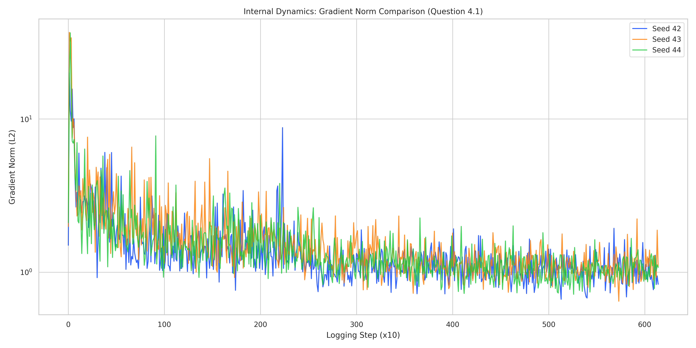
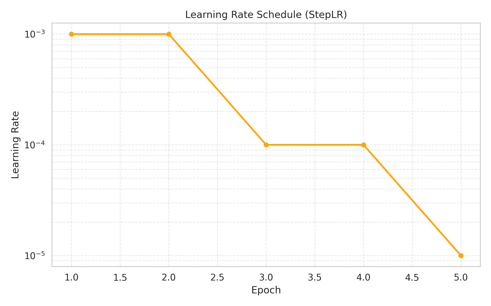

# Assignment 2: MLOps & PCAM Pipeline Journal
**MLOps & ML Programming (2026)**

## Group Information
* **Group Number:** 40
* **Team Members:** [Hanna Daorah (15565823), Leonardo Sabatini (15781542), Nick Wester (15757579), Wouter van de Scheur (14611953), Amine Belhaj (14933632)]
* **GitHub Repository:** https://github.com/nickwesterrr/MLOps_2026
* **Base Setup Chosen from Assignment 1:** [Nick Wester]

---

## Question 1: Reproducibility Audit
1. **Sources of Non-Determinism:**

   - **Global Random State:** De Python random, numpy.random en torch.rand initialiseren standaard met een willekeurige seed (vaak de systeemklok). Hierdoor zijn gewichtsinitialisatie en de WeightedRandomSampler elke run anders.
   - **DataLoader Workers:** Je gebruikt num_workers (uit de config). Elke worker start zijn eigen proces. Zonder worker_init_fn is de random state in elke worker niet gesynchroniseerd, wat zorgt voor willekeurige data-augmentaties (indien toegepast) en verwerking.
   - **Shuffle & Sampling Volgorde:** Zelfs met een fixed seed kan de volgorde waarin batches de GPU bereiken variëren door multiprocessing (race conditions tussen workers). Een torch.Generator in de DataLoader is nodig om dit te fixen.
   - **CUDA Autotuner (cudnn.benchmark):** PyTorch probeert standaard het snelste algoritme voor jouw specifieke GPU te vinden. Dit kan per run verschillen en introduceert kleine numerieke verschillen.

2. **Control Measures:**

   - **Controlled:** We stellen één globale seed in die wordt doorgegeven aan alle libraries.
   - **Controlled:** We forceren CUDA om deterministische algoritmes te gebruiken (deterministic=True, benchmark=False).
   - **Controlled:** We geven de DataLoader een seed_worker functie en een torch.Generator mee om de multiprocessing randomness te temmen.

3. **Code Snippets for Reproducibility:**
   
   # Paste the exact code added for seeding and determinism

   - [MLOps_2026/src/ml_core/utils/logging.py:]
   ```python
   import logging
   import random  # <--- Nieuw
   from typing import Any, Dict

   import numpy as np # <--- NieuW
   import torch       # <--- Nieuw
   import yaml


   def setup_logger(name: str = "MLOps_Course") -> logging.Logger:
       """Configures a standardized logger."""
       logger = logging.getLogger(name)
       if not logger.handlers:
           logger.setLevel(logging.INFO)
           handler = logging.StreamHandler()
           formatter = logging.Formatter(
               "%(asctime)s - %(name)s - %(levelname)s - %(message)s"
           )
           handler.setFormatter(formatter)
           logger.addHandler(handler)
       return logger


   def load_config(path: str) -> Dict[str, Any]:
       """Safely loads a yaml configuration file."""
       with open(path, "r") as f:
           return yaml.safe_load(f)


   def seed_everything(seed: int): # <---Nieuw: Functie geïmplementeerd
       """Ensures reproducibility across numpy, random, and torch."""
       random.seed(seed)
       np.random.seed(seed)
       torch.manual_seed(seed)
       torch.cuda.manual_seed(seed)
       torch.cuda.manual_seed_all(seed)  # Voor multi-GPU setups

       # Zorgt voor deterministisch gedrag op CUDA (trager, maar reproduceerbaar)
       torch.backends.cudnn.deterministic = True
       torch.backends.cudnn.benchmark = False
   ```

   - [MLOps_2026/src/ml_core/data/loader.py:]

   ```python
   from pathlib import Path
   from typing import Dict, Tuple
   import random  # <--- Nieuw: Toegevoegd voor seeding

   import h5py
   import numpy as np
   import torch
   from torch.utils.data import DataLoader, WeightedRandomSampler
   from torchvision import transforms

   from .pcam import PCAMDataset

   def seed_worker(worker_id):
   """
   Ensures that each DataLoader worker has a deterministic random seed.
   """
   worker_seed = torch.initial_seed() % 2**32
   np.random.seed(worker_seed)
   random.seed(worker_seed)

   def get_dataloaders(config: Dict) -> Tuple[DataLoader, DataLoader]:
   """
   Factory function to create Train and Validation DataLoaders
   using pre-split H5 files.
   """
   data_cfg = config["data"]
   base_path = Path(data_cfg["data_path"])

   # --- REPRODUCIBILITY SETUP --- `<--- Nieuw`
   # Haal de seed op uit de config (fallback naar 42 als hij mist)
   seed = config.get("seed", 42)

   # Maak een generator voor deterministische shuffling en sampling
   g = torch.Generator()
   g.manual_seed(seed)
   # -----------------------------

   # TODO: Define Transforms
   train_transform = transforms.Compose([
       transforms.ToPILImage(),
       transforms.ToTensor(),
       transforms.Normalize((0.5, 0.5, 0.5),
                            (0.5, 0.5, 0.5)),
   ])

   val_transform = transforms.Compose([
       transforms.ToPILImage(),
       transforms.ToTensor(),
       transforms.Normalize((0.5, 0.5, 0.5),
                            (0.5, 0.5, 0.5)),
   ])

   # TODO: Define Paths for X and Y (train and val)
   train_x = base_path / "camelyonpatch_level_2_split_train_x.h5"
   train_y = base_path / "camelyonpatch_level_2_split_train_y.h5"

   val_x = base_path / "camelyonpatch_level_2_split_valid_x.h5"
   val_y = base_path / "camelyonpatch_level_2_split_valid_y.h5"

   # TODO: Instantiate PCAMDataset for train and val
   train_ds = PCAMDataset(
       x_path=str(train_x),
       y_path=str(train_y),
       transform=train_transform
   )

   val_ds = PCAMDataset(
       x_path=str(val_x),
       y_path=str(val_y),
       transform=val_transform
   )

   # Add WeightedRandomSampler
   with h5py.File(train_y, "r") as f:
       labels = f["y"][:].reshape(-1)
       labels = labels[train_ds.indices]  # Apply filtering if any

   class_counts = np.bincount(labels)
   class_weights = 1.0 / class_counts
   sample_weights = class_weights[labels]

   sampler = WeightedRandomSampler(
       weights=torch.from_numpy(sample_weights).double(),
       num_samples=len(sample_weights),
       replacement=True,
       generator=g  # <--- Nieuw: Generator meegeven voor determinisme
   )

   # TODO: Create DataLoaders
   train_loader = DataLoader(
       dataset=train_ds,
       batch_size=data_cfg["batch_size"],
       sampler=sampler,
       num_workers=data_cfg["num_workers"],
       worker_init_fn=seed_worker, # <--- Nieuw: Worker seeds fixen
       generator=g                 # <--- Nieuw: Shuffle volgorde fixen
   )

   val_loader = DataLoader(
       dataset=val_ds,
       batch_size=data_cfg["batch_size"],
       shuffle=False,
       num_workers=data_cfg["num_workers"],
       worker_init_fn=seed_worker, # <--- Nieuw: Ook voor val
       generator=g
   )

   return train_loader, val_loader
   ```

   - [MLOps_2026/experiments/train.py:]

   ```python
   import argparse

   import torch
   import torch.optim as optim

   from ml_core.data import get_dataloaders
   from ml_core.models import MLP
   from ml_core.solver import Trainer

   # We importeren nu seed_everything erbij

   from ml_core.utils import load_config, seed_everything

   # logger = setup_logger("Experiment_Runner")

   def main(args):
   # 1. Load Config
   config = load_config(args.config)

   # --- REPRODUCIBILITY START ---
   # Haal seed uit config, fallback naar 42 als hij er niet staat
   seed = config.get("seed", 42)
   seed_everything(seed)
   print(f"Global Random Seed set to: {seed}")
   # --- REPRODUCIBILITY END ---

   # 2. Setup Device
   device = torch.device("cuda" if torch.cuda.is_available() else "cpu")
   print(f"Using device: {device}")

   # 3. Data
   train_loader, val_loader = get_dataloaders(config)

   # 4. Model
   model = MLP(
       input_shape=config["data"]["input_shape"],
       hidden_units=config["model"]["hidden_units"],
       dropout_rate=config["model"]["dropout_rate"],
       num_classes=config["model"]["num_classes"],
   )

   # 5. Optimizer
   optimizer = optim.SGD(
       model.parameters(),
       lr=config["training"]["learning_rate"],
   )

   # 6. Trainer & Fit
   trainer = Trainer(
       model=model,
       optimizer=optimizer,
       config=config,
       device=device,
   )

   trainer.fit(train_loader, val_loader)

   torch.save(trainer.tracker, "trainer_tracker.pt")

   if name == "main":
   	parser = argparse.ArgumentParser(description="Train a Simple MLP on PCAM")
   	parser.add_argument("--config", type=str, required=True, help="Path to config yaml")
   	args = parser.parse_args()
   	main(args)
   ```

4. **Twin Run Results:**

    - [Amine](assets/plots/question_1.4_amine)
    - [Hanna](assets/plots/question-1.4-hanna)
    - [Leonardo](assets/plots/question-1.4-Leonardo)

    - No, we did not obtain identical results. While all three runs exhibit the same general overfitting trend (decreasing training loss but increasing validation loss), the specific numerical values differ, with the final validation loss varying between approximately $0.63$ and $0.67$ across the different runs. This discrepancy indicates that sources of non-determinism remain, likely due to differences in hardware floating-point precision (non-deterministic CUDA operations) or unseeded randomness in the data loading process across our different user environments.

    - 2 group members (Wouter and Nick) were not able to train the model for this particular question. We encountered many issues in virtual environment dependencies and their versions. We spent a lot of time to resolve these issues to finally get the training to work, however this did not succeed and we wanted to continue to the rest of the questions and thus we decided that Wouter and Nick could skip this question.
---

## Question 2: Data, Partitioning, and Leakage Audit
1. **Partitioning Strategy:**
   - **Method:** We used the pre-defined H5 splits provided in the SURFDrive (camelyonpatch_level_2_split_train_x.h5, etc.). We did not shuffle and re-split the raw data ourselves; we trusted the provided split to ensure consistency with other groups and the course baseline.
   - **Counts:**
      - Train: 157,286 images (approx. 83%)
      - Validation: 32,768 images (approx. 17%)

2. **Leakage Prevention:**
   - In loader.py, we use a fixed heuristic for normalization: transforms.Normalize((0.5, 0.5, 0.5), (0.5, 0.5, 0.5)).
     These values are hard-coded and independent of the dataset statistics.
     If we had calculated the mean and std based on the entire dataset (Train + Validation + Test) and then applied it, that would be leakage (information from test set influencing training).
     Ideally, we would calculate mean/std on the Train set only and apply those fixed values to Validation/Test, but the current 0.5 heuristic is safe from leakage, but less precise.

3. **Cross-Validation Reflection:**

   - **Need for k-fold:** No, nested k-fold cross-validation is not recommended for this setup
   - **Reason:** Deep Learning on large datasets (like PCAM) is computationally very expensive. Training 5 or 10 folds would take 5-10x the compute time.
   - **Best Method:** A simple Train/Validation/Test split (Hold-out method) is standard for this scale. The dataset is large enough that the Validation set is statistically representative, making the variance in performance estimation low enough to not require k-fold.

4. **The Dataset Size Mystery:**

   - **Reason:** The training dataset we received is stored using the float32 data type (4 bytes per pixel), whereas the original PCAM dataset uses uint8 (1 byte per pixel).
     Even though our dataset has fewer images (~157k vs ~327k in original), the switch from 1 byte to 4 bytes per pixel increases the storage requirement by a factor of 4.
   - **Solution:**  In loader.py, we explicitly cast the data back to the correct format using np.clip(image, 0, 255).astype(np.uint8). This resolves the issue at runtime, treating the inputs consistently regardless of how they are stored on disk.

5. **Poisoning Analysis:**    
   - The most likely poisoning type is pixel intensity shift or scaling. This is suggested by the Intensity Outliers plot from Assignment 1 and the unusually large file size. If image values are stored as floats or fall outside the normal 0–255 range, the file size increases. The histograms showed clear outliers, and some image tiles appear empty (all zeros) or contain artifacts. This matches what we would expect from incorrect intensity values. The preprocessing step in loader.py, where values are clipped to 0–255 and converted to uint8, also suggests that invalid pixel values are present in the data.
---

## Question 3: Configuration Management
1. **Centralized Parameters:**

   - `optimizer`: previously hardcoded to SGD
   - `seed`: for reproducibility
   - `hidden_units`: architecture configuration
   - `learning_rate`: hyperparameter
   - `experiment_name`: used for output filenames


2. **Loading Mechanism:**

   - [Describe your use of YAML, Hydra, or Argparse.]
   ```yaml
   # Snippet showing how parameters are loaded
   experiment_name: "pcam_mlp_baseline"
   seed: 42

   data:
   dataset_type: "pcam"
   # TODO: download the dataset and set the relative path here
   data_path: "./data/pcam" 
   input_shape: [3, 96, 96]
   batch_size: 32
   num_workers: 2

   model:
   hidden_units: [64, 32]
   dropout_rate: 0.2
   num_classes: 2

   training:
   epochs: 5
   learning_rate: 0.001
   optimizer: "adam" # <--- Nieuw: Configurable optimizer
   log_after_steps: 10
   save_dir: "./experiments/results"
   ```

3. **Impact Analysis:**

   - **Reproducibility:** The YAML file serves as a "recipe". Anyone with the YAML can reproduce the exact run (including seed and arch).
   - **Experiment Comparison:** We can simply create config_sgd.yaml and config_adam.yaml without changing Python code.
   - **Collaboration:** Teammates can share config files instead of passing code snippets or command line strings.

4. **Remaining Risks:**

   - Config files might not be version controlled properly (e.g. people change values locally without committing)
   - Dependencies (library versions) are not captured in YAML, only hyperparameters.

---

## Question 4: Gradients & LR Scheduler
1. **Internal Dynamics:**

    - 

    - Plotting the global gradient norm with step-level granularity reveals high variance and "noise" between individual batches, which indicates significant instability in the training dynamics that would be hidden if only epoch-level averages were used. The gradient spikes observed, particularly during the initial steps, suggest the presence of outliers or "poisoned" data points in the PCAM dataset which cause sudden and extreme updates to the model weights

2. **Learning Rate Scheduling:**

    - 

    - We chose the StepLR scheduler. It decays the learning rate by a factor of gamma=0.1 every step_size=2 epochs. (look at train_config.yaml)

    - Reducing the learning rate in the final stages of training is essential because it allows the optimizer to take smaller, more precise steps, which prevents the weights from "overshooting" or oscillating around the local minimum and enables the model to settle accurately into the deepest part of the loss valley

---


## Question 5: Part 1 - Experiment Tracking
1. **Metrics Choice:**

    - **Primary Metric:** F2-Score (F-Beta with β = 2)
        - **Reason:** In medical diagnosis, False Negatives (missing cancer) are much worse than False Positives (unnecessary biopsy). We chose β=2 (F2-Score) to weigh Recall twice as heavily as Precision.
    - **Secondary Metric:** ROC-AUC (Area Under Receiver Operating Characteristic).
        - **Reason:** It shows how well the model separates classes regardless of the classification threshold.

2. **Results (Average of 3 Seeds):**

3. **Logging Scalability:**

4. **Tracker Initialization:**
   ```python
   # Snippet showing tracker/MLFlow/W&B initialization
   ```

5. **Evidence of Logging:**

6. **Reproduction & Checkpoint Usage:**

7. **Deployment Issues:**

---

## Question 5: Part 2 - Hyperparameter Optimization
1. **Search Space:**
2. **Visualization:**
3. **The "Champion" Model:**

4. **Thresholding Logic:**

5. **Baseline Comparison:**

---

## Question 6: Model Slicing & Error Analysis
1. **Visual Error Patterns:**

2. **The "Slice":**

3. **Risks of Silent Failure:**

---

## Question 7: Team Collaboration and CI/CD
1. **Consolidation Strategy:** 
2. **Collaborative Flow:**

3. **CI Audit:**

4. **Merge Conflict Resolution:**

5. **Branching Discipline:**

---

## Question 8: Benchmarking Infrastructure
1. **Throughput Logic:**

2. **Throughput Table (Batch Size 1):**

| Partition | Node Type | Throughput (img/s) | Job ID |
| :--- | :--- | :--- | :--- |
| `thin_course` | CPU Only | | |
| `gpu_course` | GPU ([Type]) | | |

3. **Scaling Analysis:**

4. **Bottleneck Identification:**

---

## Question 9: Documentation & README

1. **README Link:** https://github.com/nickwesterrr/MLOps_2026/blob/main/README.md

2. **README Sections:**
   - **Installation:** Includes clear steps to create a virtual environment and install dependencies (e.g., `python -m venv .venv`, `source .venv/bin/activate`, `pip install -e .`).
   - **Data Setup:** Explains that the PCAM H5 files must be placed under `./data/` (because `data_path: "./data/"` in the config) and lists the required filenames.
   - **Training:** Provides the exact command and config to reproduce the run: 
     ```bash
     python experiments/train.py --config experiments/configs/train_config.yaml
     ```  
     Also states what validation/test performance to expect (validation/test metrics should be filled in with your final champion numbers once confirmed).
   - **Inference:** Provides the exact command to run a single prediction demo using the saved checkpoint: 
     ```bash
     python scripts/inference.py checkpoints/best_model.pt experiments/configs/train_config.yaml
     ```  
     The script loads the checkpoint and runs inference on validation samples, printing predictions and tumor probabilities.

3. **Offline Handover:** Files/info needed on a USB stick to run the model offline (no internet): 
   - `checkpoints/best_model.pt` (the saved best model checkpoint committed to the repo).
   - `scripts/inference.py` (inference entrypoint).
   - `experiments/configs/train_config.yaml` (exact config/hyperparameters used).
   - `src/ml_core/` (all source code required to import `ml_core` and run).
   - `pyproject.toml` and/or `requirements.txt` (dependency list).
   - PCAM dataset H5 files in the expected `./data/` folder with the exact filenames specified in the README.
   - A ready-to-use environment for the target cluster (either a compatible pre-built `.venv` or an offline wheelhouse of Python packages), since there is no internet to install dependencies.


---

## Final Submission Checklist
- [X] Group repository link provided?
- [X] Best model checkpoint pushed to GitHub?
- [X] inference.py script included and functional?
- [ ] All Slurm scripts included in the repository?
- [ ] All images use relative paths (assets/)?
- [X] Names and IDs of all members on the first page?